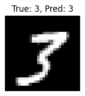
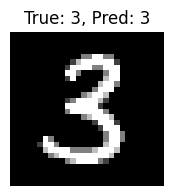

# MNIST Training & Testing Automation

[](https://github.com/raselmandol/git-ml/actions/workflows/train_mnist.yml)
[](https://raselmandol.github.io/git-ml/)
[](https://opensource.org/licenses/MIT)
[](https://www.python.org/downloads/)
[](https://pytorch.org/)

> **View training insights!** Visit the [live dashboard](https://raselmandol.github.io/git-ml/) to see real-time training metrics, model performance, and automated pipeline results.

This repository provides a fully automated pipeline for training and testing a simple neural network on the MNIST dataset using PyTorch. All steps are orchestrated via GitHub Actions, so you get fresh results and logs every time you push or on a schedule.

## Features
- **Automatic Training & Testing:** Runs on every push, manual trigger, or every 6 hours
- **Rich Visualizations:** Training loss and accuracy graphs with sample prediction images
- **Detailed Logs:** Beautiful markdown reports with embedded charts and images
- **Model Persistence:** Trained model weights are saved and version-controlled
- **Training Dashboard:** View training insights live on GitHub Pages
- **Easy to Extend:** Simple, clean code structure for experimentation

## Project Structure

```
git-ml/
├── train_mnist.py          # Main training script
├── utils.py               # Utility functions for logging & visualization
├── requirements.txt        # Python dependencies
├── train_output.md         # Training metrics & graphs
├── test_output.md          # Test results & sample predictions
├── mnist_model.pt          # Trained model weights
├── images/                # Generated plots & sample images
├── docs/                   # GitHub Pages website
│   ├── index.html            # Training dashboard page
│   ├── style.css             # Responsive styling
│   └── script.js             # Dashboard functionality
└── .github/workflows/      # Automation workflows
    └── train_mnist.yml       # Training pipeline
    └── pages.yml
```

## Technical Details 

### Model Architecture
- **Input:** 28×28 grayscale images (784 features)
- **Output:** 10 classes (digits 0-9)
- **Optimizer:** SGD with learning rate 0.01
- **Loss Function:** Cross-entropy loss

### Training Configuration
- **Epochs:** 15
- **Batch Size:** 64
- **Dataset:** MNIST (60k train, 10k test)
- **Device:** Auto-detection (CUDA if available, else CPU)

### Performance Metrics
- **Model Type:** Simple feedforward neural network
- **Dataset:** MNIST handwritten digits
- **Training Time:** ~2-3 minutes on CPU

## Quick Start 

### Option 1: View the Live Dashboard
Visit the [**training dashboard**](https://raselmandol.github.io/git-ml/) to view real-time training metrics, model performance insights, and automated pipeline results!

### Option 2: Run Locally
1. **Clone the repository:**
   ```bash
   git clone https://github.com/raselmandol/git-ml.git
   cd git-ml
   ```

2. **Install dependencies:**
   ```bash
   pip install -r requirements.txt
   ```

3. **Run training:**
   ```bash
   python train_mnist.py
   ```

4. **View results:**
   - Check `train_output.md` for training metrics and graphs
   - Check `test_output.md` for test results and sample predictions
   - Images are saved in the `images/` folder

### Option 3: GitHub Actions (Automated)
The workflow automatically runs on:
- Every push to main branch
- Manual trigger via Actions tab
- Every 6 hours (scheduled)

Results are automatically committed back to the repository!

**Need detailed setup instructions?** Check out the [comprehensive setup guide](SETUP.md)!


## Example Output

### Training Metrics & Visualizations
The automated pipeline generates comprehensive training reports with interactive visualizations:

**Training Progress:**


### Test Results & Sample Predictions
The model is thoroughly evaluated on the test set, with sample predictions displayed:

**Sample MNIST Predictions:**
  

*True labels vs Predicted labels are shown for each sample*

## Customization

Want to experiment? Here are some ideas:

### Model Improvements
- Add more hidden layers or change activation functions in `train_mnist.py`
- Experiment with different optimizers (Adam, AdamW, etc.)
- Try data augmentation techniques
- Implement batch normalization or dropout

### Visualization Enhancements
- Modify `utils.py` to add confusion matrices
- Create loss/accuracy comparison charts
- Add model architecture diagrams

### Automation Extensions
- Add model performance benchmarking
- Implement automatic hyperparameter tuning
- Set up notification systems for training completion

## Contributing

Contributions are welcome! Here's how you can help:

1. Fork the repository
2. Create a feature branch: `git checkout -b feature-name`
3. Make changes and add tests
4. Commit changes: `git commit -m 'Add feature description'`
5. Push to the branch: `git push origin feature-name`
6. Open a Pull Request

## License

This project is licensed under the MIT License - see the [LICENSE](LICENSE) file for details.

## Acknowledgments

- PyTorch team for the amazing deep learning framework
- GitHub Actions for seamless CI/CD
- MNIST dataset creators for the classic benchmark
- The open-source community for inspiration and tools
- Copilot, Claude Sonnet 4, GPT-4.1: For always helping me debug errors, suggest code and fixes, and build this repo--including this README.

---

<div align="center"> 

**The last commits to this repository were pushed using koelbit-r3 MCP, which is currently under development.**

</div>

<div align="center">

**Star this repo if you found it helpful!**

[Live Demo](https://raselmandol.github.io/git-ml/) • [Latest Results](train_output.md) • [Report Bug](https://github.com/raselmandol/git-ml/issues) • [Request Feature](https://github.com/raselmandol/git-ml/issues)

</div>
