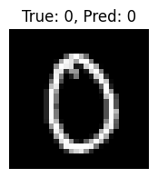
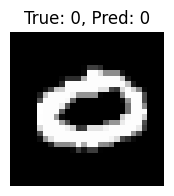
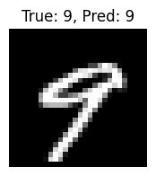
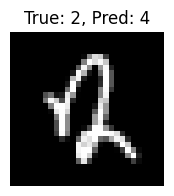
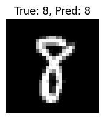

# Test Results

- **Test Loss**: 0.2493
- **Test Accuracy**: 0.9304

## Sample Predictions

| Image Index | True Label | Predicted Label |
|-------------|------------|------------------|
| 5987 | 0 | 0 |
| 1286 | 8 | 8 |
| 3540 | 0 | 0 |
| 7993 | 3 | 3 |
| 8657 | 0 | 0 |

### Sample Images
 True: 0, Pred: 0
 True: 0, Pred: 0
 True: 9, Pred: 9
 True: 2, Pred: 4
 True: 8, Pred: 8
