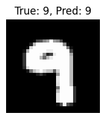
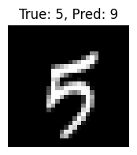
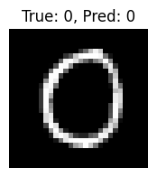
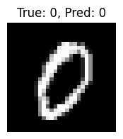
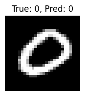

# Test Results

- **Test Loss**: 0.2458
- **Test Accuracy**: 0.9296

## Sample Predictions

| Image Index | True Label | Predicted Label |
|-------------|------------|------------------|
| 9818 | 0 | 0 |
| 6207 | 6 | 6 |
| 3923 | 6 | 6 |
| 6702 | 1 | 1 |
| 6181 | 0 | 0 |

### Sample Images
 True: 9, Pred: 9
 True: 5, Pred: 9
 True: 0, Pred: 0
 True: 0, Pred: 0
 True: 0, Pred: 0
