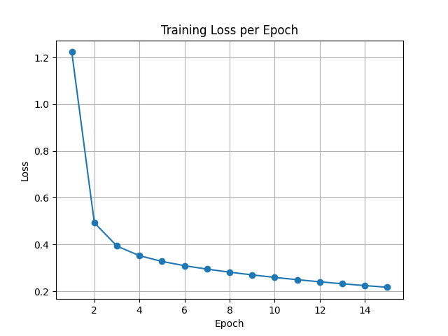
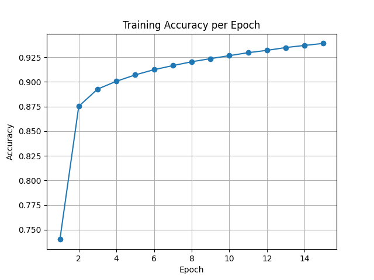

# Training Metrics

| Epoch | Loss | Accuracy |
|-------|------|----------|
| 1 | 1.2230 | 0.7402 |
| 2 | 0.4931 | 0.8753 |
| 3 | 0.3933 | 0.8927 |
| 4 | 0.3521 | 0.9007 |
| 5 | 0.3274 | 0.9072 |
| 6 | 0.3093 | 0.9124 |
| 7 | 0.2944 | 0.9166 |
| 8 | 0.2815 | 0.9205 |
| 9 | 0.2698 | 0.9237 |
| 10 | 0.2592 | 0.9267 |
| 11 | 0.2493 | 0.9297 |
| 12 | 0.2404 | 0.9321 |
| 13 | 0.2319 | 0.9349 |
| 14 | 0.2241 | 0.9371 |
| 15 | 0.2169 | 0.9391 |

## Training Loss Graph

## Training Accuracy Graph

